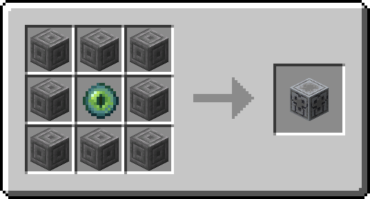

# Twinned Effigy

**Twinned Effigy** allows players to link their inventory to the eponymous **Twinned Effigy** block, enabling **Hoppers**, pipes, and automation systems to insert and extract items directly from those players' inventories.

The inspiration for this mod loosely comes from **cubicmetre**'s video "The Crisis in Storage Tech". Namely, it's an attempt to lessen the crisis by implementing something based on the "shadowed item stacks" bug shown at [24:15](https://youtu.be/GyUL3PbjWcw?t=1455).

Now, the **Twinned Effigy** is crafted as follows:

Twinned Effigy Recipe

Once placed, a player can interact with it (right-clicking it) to entwine their inventory to the **Twinned Effigy** itself, causing its "eyes" to glow experience-green.

An active **Twinned Effigy** acts as a proxy to the main 3x9 section of the entwined player's inventory—leaving the hotbar and armor slots untouched—regardless of distance and across dimensions, at least as long as the **Twinned Effigy** is chunk loaded and the player is logged in.

Alas, breaking the **Twinned Effigy** resets it, disentwining it from the inventory, although a gentler touch—a _silkier_ touch—might, perhaps, maintain the entwining...

And be warned, for a terrible fate awaits those whose effigies fall into enemies' hands.

Regarding this terrible fate...

Just a note for multiplayer servers and their admins.
 
A malicious player with access to another player's **Twinned Effigy** may grief the first by continuously emptying their inventory, making advancing almost impossible and playing very frustrating.

Use this mod with caution.

## Ideas for Future Features

In no particular order and with no promise to actually do any of these:

- [ ] Design better textures and sounds for the **Twinned Effigy**, perhaps even turning the block into an actual three-dimensional effigy.
- [ ] Prevent the **Twinned Effigy** from moving certain items out of a player's inventory, perhaps due to _curses_.
- [ ] Implement an **Eldritch Effigy** that acts as a proxy to a player's **Ender Chest**'s inventory (with textures and all, which are the hard parts).
- [ ] Implement a **Gilded Effigy** that can forward effects granted by the likes of **Beacons** and potions to the entwined player, instead of proxying their inventory.
- [ ] Implement a way for a player to disentwine themselves from effigies remotely.
